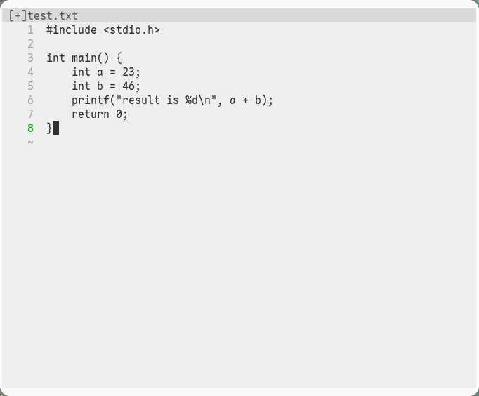

# laed
A layman text editor

## todo
- [x] undo redo
- [x] auto pairs insertion
- [x] auto indentation
- [x] line numbers
- [x] open/close file from cli
- [ ] use ropes instead of gap buffer
- [ ] text selection
- [ ] command palette
- [ ] vim mode
- [ ] tabs
- [ ] copy paste
- [ ] syntax highlighting
- [ ] file manager

<table>
  <tr>
    <td></td>
    <td></td>
  </tr>
</table>
